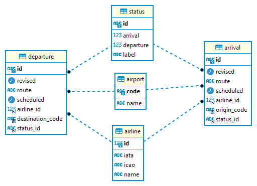

# Flight Board Demo

## Requirements

Airport arrival and departure app - Create a web app that is able to read from a database of your choice and display incoming and outgoing
flights of a given airport. Below are the high-level requirements.
- The application should highlight delayed flights based on arrival/departure scheduled times and the current system time.
- Provide an admin view that allows for the insertion of new inbound and outbound flights.

Tech details
- The front end should be written in angular and extra points are given if the design is responsive.
- Create as a Spring Boot application
- Define a simple schema that allows for the listing of inbound and outbound flights. Include information you deem relevant. List any assumptions made etc

## Assumptions & Estimates

- Based off [Toronto Pearson Airport (YYZ)](https://www.torontopearson.com/en/whats-happening/stories/whyyz/how-our-runways-work),
  - Average 1,300 flights arrive or depart from Pearson each day with 6 months of data retention. Assuming arrivals & departures are equal. 1,300 flights x 6 months retention period x 30 days/month = 234,000 flights in 6 months, i.e, 117,000 arrivals and departures, respectively. **100 GB storage space** will suffice.
  - Average 130,000 passengers fly via YYZ each day. 130,000 passengers each day/24 hours ≈ 5,416 passengers/hour. Assuming passengers & maybe 2 of thier loved ones visit the flight board app for updates on an 10 min basis, which makes 16,248 hourly ≈ 270 minutely ≈ 5 secondly visitor traffic. This translates to atleast 5+ read queries on the database per second. Hence the system has to be **optimized for high reads compared to writes**. This can be achieved with a cluster configuration wherein a primary DB receives writes and replica DBs for reads. DB indexes, DB server query cache, server-side caching, full-text search engine, etc... can help further to optimize performance.
  - Assuming atleast 10 RPS with each task time of 100ms would require **4 cores of compute power**, [RPS = Num. cores/Task time](https://wrongsideofmemphis.com/2013/10/21/requests-per-second-a-reference/)
- Admins work in 8 hour shifts and ONLY one admin makes updates to flight details at any given time
- Peaks and troughs will require **auto-scaling** of the app & database
- User traffic based on geography would require **regional scaling**
- Implementing solution in Microsoft Azure
- YYZs flight board currently requires users to refresh the page to load new or updated flight details. A better approach would be to push changes via a **real-time messaging system**

## Design

- Making a prototype based on YYZs flight board for [arrivals](https://www.torontopearson.com/en/arrivals) & [departures](https://www.torontopearson.com/en/departures)
- Using [global airlines & airports data](https://openflights.org/data.html) and [massaging the data](https://github.com/MrC0mm0n/flight-board-demo/tree/main/flight-board-demo-rest-api/data)

### Arrival Board UI

#### Angular Frontend
Arrival component to display below tabular data. After admin logs in, admin features will be visible on the UI.
| Arriving time  | Status | Origin | Airline | Flight  |
| ------------- | ------------- | ------------- | ------------- | ------------- |
| ~~11:52~~ 18:43 | DELAYED | Dallas-Fort Worth, USA | AIR CANADA JAZZ | AC8974 |

#### Spring Boot Backend
| HTTP Method  | URI | Description |
| ------------- | ------------- | ------------- |
| GET  | /arrival?from=:datetime&to=:datetime  | Get flights between particular datetime intervals |
| POST  | /arrival  | Save new flight details |
| PATCH  | /arrival/{id}  | Update existing flight details |

### Departure Board UI

#### Angular Frontend
Departure component to display below tabular data. After admin logs in, admin features will be visible on the UI.
| Departing time  | Status | Destination | Airline | Flight # |
| ------------- | ------------- | ------------- | ------------- | ------------- |
| ~~11:52~~ 18:43 | DELAYED | Dallas-Fort Worth, USA | AIR CANADA JAZZ | AC8974 |

#### Spring Boot Backend
| HTTP Method  | URI | Description |
| ------------- | ------------- | ------------- |
| GET  | /departure?from=:datetime&to=:datetime  | Get flights between particular datetime intervals |
| POST  | /departure  | Save new flight details |
| PATCH  | /departure/{id}  | Update existing flight details |

Using [Spring Data REST](https://spring.io/projects/spring-data-rest) for backend APIs to [speed up development](https://speakerdeck.com/olivergierke/advanced-spring-data-rest?slide=5)

## Data Model

## Architectural Comonents, Diagram & Scalability

- [Azure Database for MariaDB](https://azure.microsoft.com/en-us/products/mariadb/)
- [Azure Spring Apps](https://azure.microsoft.com/en-us/products/spring-apps/)
- [Azure Content Delivery Network](https://azure.microsoft.com/en-us/products/cdn/)
- [Azure Load Balancer](https://azure.microsoft.com/en-us/products/load-balancer/)
- [Application Gateway](https://azure.microsoft.com/en-us/products/application-gateway/)
- [Azure Web PubSub](https://azure.microsoft.com/en-us/products/web-pubsub/)

This solution will cost  and upwards
